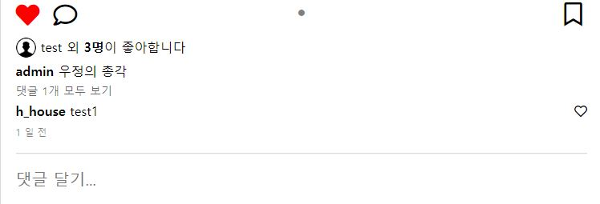
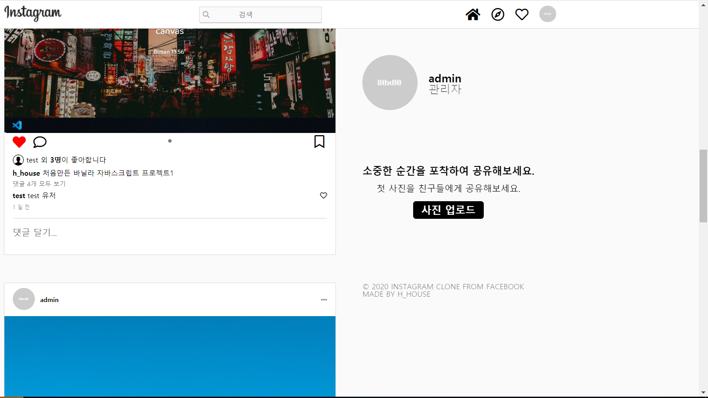
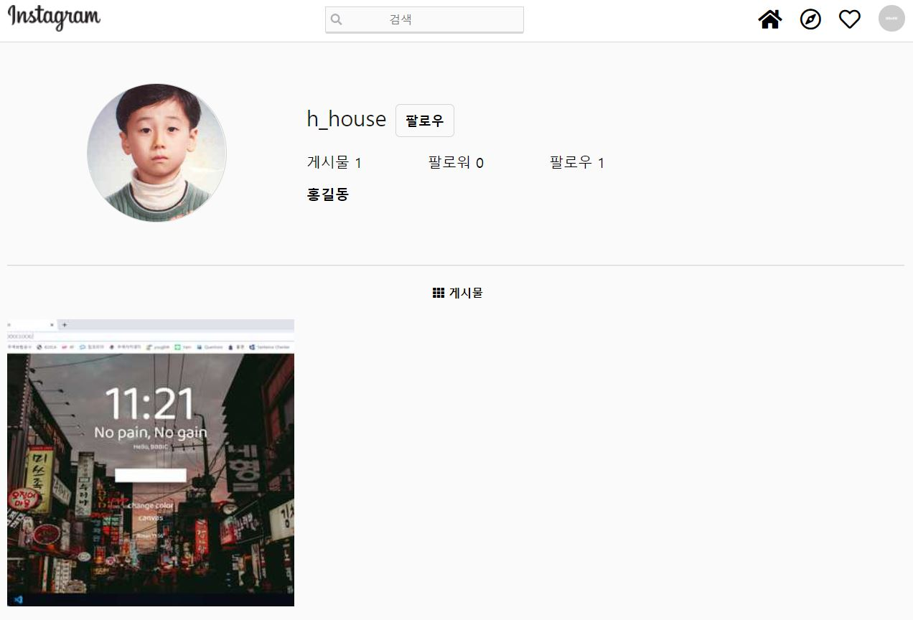

# Hyostagram
##### 인스타그램 클론했습니다.
##### HTML부터 CSS 직접 작성했으며, 장고로 백엔드 구현했습니다.
[효스타그램](https://stark-ridge-05336.herokuapp.com "효스타그램으로 이동")
* * *
### 구현한 기능
#### AJAX렌더링(좋아요, 댓글, 검색)

#### 무한스크롤(바닐라JS)

#### 팔로우한 유저 사진만 렌더링(바닐라JS)

#### 회원가입에 facebook API 활용
#### 로그인한 유저만 페이지를 볼 수 있도록 권한 설정
#### Heroku배포, AWS S3 이용
